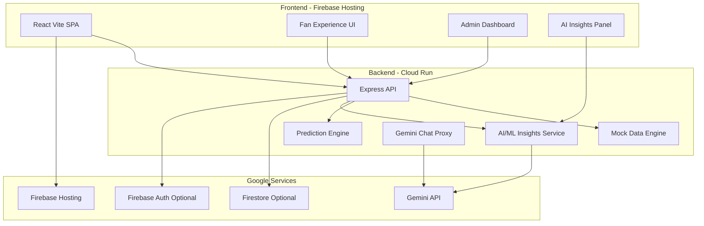

# VenueFlow - Physical Event Experience Platform

## 1. Challenge Summary
VenueFlow improves attendee experience at large sports venues by reducing crowd friction, queue waiting, and coordination delays with a context-aware assistant and operations dashboard.

## 2. Chosen Vertical and Persona
- Vertical: Physical Event Experience
- Primary Persona: Stadium attendee (fan) using a mobile-first assistant
- Secondary Persona: Venue operator using admin analytics and alert controls

## 3. Problem Statement
Design a solution that improves the physical event experience for attendees at large-scale sporting venues. The system should address challenges such as crowd movement, waiting times, and real-time coordination, while ensuring a seamless and enjoyable experience.

## 4. Recent UI/UX Enhancements (Latest Update)
The platform now features a modern, polished interface with:
- Advanced glassmorphism effects with backdrop blur
- Smooth micro-interactions and staggered animations
- Real-time toast notifications for critical alerts
- Enhanced loading states with skeleton screens
- Improved mobile responsiveness
- Animated gradient backgrounds
- Glow effects on interactive elements
- Better visual hierarchy with icons and badges
- Floating particle effects on landing page
- Smooth page transitions and hover effects

## 5. What Is Implemented
### Frontend (React + Vite)
- Landing page with authentication-style entry and animated hero section
- Dashboard with live heatmap simulation plus 15-minute zone forecasting
- Virtual queue page
- Food ordering page
- Smart navigation page with phase-aware and mobility-aware route recommendations
- Parking page with availability cards
- Emergency and safety page
- Admin analytics page
- Gemini-backed chatbot with fallback
- AI/ML Insights panel for context-aware recommendations
- Toast notification system for real-time alerts
- Advanced loading states and skeleton screens

### Backend (Node.js + Express)
- Queue, food, chat, alerts, analytics, parking APIs
- Navigation intelligence API for route scoring and alternatives
- Dedicated AI/ML insights API
- Hybrid prediction engine (crowd and wait-time)
- Gemini integration for conversational and summary narratives
- Dockerfile for Cloud Run

## 6. AI/ML Service (Hackathon Critical)
VenueFlow includes a dedicated AI/ML decision service, not only static mock responses.

### Service Design
- API: POST /api/ml/insights
- Input context: seat, user intent, mobility need, first-visit flag
- Data signals: live crowd snapshot, queue status, parking availability, active alerts
- Inference engine: Hybrid Context Model (HCM)
  - Rule layer for domain constraints and safety
  - Scoring layer using weighted features + sigmoid normalization
  - Recommendation layer for gate, queue, parking, and action plan
- Optional Gemini summary generation for natural-language recommendations

### Why this qualifies as AI/ML
- Context-aware inference changes output per user profile and venue state
- Risk scoring produces numerical and categorical predictions
- Decision policy combines multiple real-time features for personalized recommendations
- Uses Google Gemini for intelligent narrative output

## 7. Logical Decision-Making Approach
Decision logic uses weighted features:
- Crowd occupancy ratio
- Ratio of high/critical zones
- Normalized queue pressure
- Alert severity signal
- User context (mobility and first-visit)

Model output includes:
- Crowd risk score
- Crowd risk band (low/medium/high/critical)
- Predicted wait time
- Recommended arrival offset
- Gate, queue, and parking recommendations
- Action list for user

## 8. Mock Data vs Real Integrations
| Area | Status | Notes |
|---|---|---|
| Crowd Heatmap | Mock (realistic simulation) | Time-pulse + zone trend logic |
| Virtual Queue | Mock + predictive model | Queue state and wait predictions |
| Food Ordering | Mock workflow | Order lifecycle simulation |
| Emergency Alerts | Mock stream | Admin-triggered alert objects |
| AI Chatbot | Real Gemini + fallback | Gemini 2.5 Flash endpoint |
| AI/ML Decision Service | Real inference logic + optional Gemini summary | Dedicated /api/ml/insights |
| Parking Guidance | Mock occupancy + recommendation logic | Seat-aware recommendation |

## 9. Google Services Usage
- Gemini API (Google AI Studio): chatbot and AI summary layer
- Cloud Run: backend container deployment target
- Firebase Hosting: frontend static hosting target with rewrite support
- Firestore/Auth (integration-ready in architecture): documented for production expansion

## 10. Architecture Overview


## 11. Repository Structure (Current)
```text
Physical Event Experience/
|- src/
|  |- components/
|  |  |- Toast.tsx (NEW)
|  |  |- LoadingStates.tsx (NEW)
|  |  |- (enhanced components)
|  |- pages/
|  |- data/
|  |- App.tsx
|  |- main.tsx
|  |- app.css (enhanced)
|  |- index.css (enhanced)
|- backend/
|  |- routes/
|  |- services/
|  |- mock/
|  |- server.js
|  |- Dockerfile
|- scripts/
|  |- deploy-frontend.ps1
|  |- deploy-backend.ps1
|- firebase.json
|- .firebaserc
|- task.md
|- PLAN_README.md
```

## 12. Key API Endpoints
- GET /api/health
- GET /api/queue
- POST /api/queue/join
- POST /api/queue/leave
- GET /api/food/menu
- POST /api/food/order
- GET /api/analytics/overview
- POST /api/chat
- GET /api/parking
- GET /api/parking/recommendation
- GET /api/navigation/assist
- POST /api/ml/insights

### Example: AI/ML Insights Request
```json
{
  "seat": "B-127",
  "intent": "quick",
  "mobilityNeed": false,
  "firstVisit": true
}
```

### Example: AI/ML Insights Response (shape)
```json
{
  "model": { "name": "VenueFlow-Hybrid-Context-Model", "version": "1.1.0", "type": "hybrid-rule-ml" },
  "predictions": {
    "crowdRiskScore": 0.61,
    "crowdRiskLevel": "high",
    "expectedQueueWaitMinutes": 12,
    "recommendedArrivalOffsetMinutes": 15
  },
  "recommendations": {
    "gate": "Gate A",
    "queue": "Masala Wrap Point",
    "parking": "Parking C",
    "actions": ["..."]
  },
  "provider": "gemini+hcm"
}
```

## 13. Local Setup
```bash
# root frontend
npm install
npm run dev

# backend
npm --prefix backend install
npm run dev:backend
```

## 14. Deployment (Google Cloud)
### Frontend to Firebase Hosting
```powershell
./scripts/deploy-frontend.ps1 -FirebaseProjectId your-firebase-project-id
```

### Backend to Cloud Run
```powershell
./scripts/deploy-backend.ps1 -ProjectId your-gcp-project-id -Region asia-south1
```

## 15. Security, Accessibility, and Code Quality
### Security
- Environment-variable based API key usage (no hardcoded secrets)
- Input validation on API routes
- CORS and JSON body parsing controls
- Fallback-safe AI responses when provider is unavailable

### Accessibility
- Semantic landmarks and structured forms
- Keyboard-friendly controls and buttons
- Clear text hierarchy and high-contrast UI palette
- ARIA labels where appropriate
- Focus states on interactive elements

### Code Quality
- TypeScript on frontend for safer contracts
- Modular backend by route/service/mock separation
- Reusable components and consistent styling tokens
- Clean component architecture with hooks
- Optimized animations and performance

## 16. Testing and Validation
### Automated checks run
- Frontend build: npm run build ✓
- Backend syntax checks on updated server/routes/services

### Manual checks
- Route navigation and responsive layout
- Queue join/leave flow
- Food add/order flow
- Emergency trigger flow
- AI chatbot and AI/ML insights panel behavior
- Toast notifications for critical events
- Loading states and skeleton screens
- Mobile responsiveness

## 17. Assumptions
- Real sensor and POS integrations are not available during hackathon
- Gemini key may not always be present; fallback behavior is required
- Firestore/Auth are represented in architecture and can be enabled in production setup

## 18. How This Meets Challenge Expectations
- Smart dynamic assistant: Gemini chatbot + AI/ML insights engine
- Logical decision making: context-aware risk/recommendation model
- Effective Google services usage: Gemini, Cloud Run, Firebase Hosting
- Practical usability: end-to-end fan and admin flows with polished UI
- Clean maintainable code: modular services, typed UI contracts, reusable components

## 19. UI/UX Excellence
The platform demonstrates modern web design principles:
- Glassmorphism with backdrop blur effects
- Micro-interactions and smooth animations
- Real-time feedback with toast notifications
- Progressive loading with skeleton screens
- Responsive design for all screen sizes
- Accessibility-first approach
- Performance-optimized animations
- Consistent design system with CSS variables

## 20. Submission Checklist Alignment
This repository includes:
- Complete code for frontend and backend
- README covering vertical, approach, logic, assumptions, deployment, and evaluation focus
- Public-friendly structure for single-branch hackathon delivery
- Modern, production-ready UI/UX
- Google Services integration (Gemini AI)
- Real-world usability with polished interface

## 21. Real-World QA Checklist (Crowd and Movement)
- Entry surge scenario: Validate that route recommendation avoids highest-pressure gate during first 30 minutes.
- Halftime transition scenario: Validate route recalculation with phase set to halftime and compare ETA differences.
- Exit wave scenario: Validate stagger guidance and hotspot warnings for critical zones.
- Mobility scenario: Enable mobility-friendly mode and confirm routes prefer ramp-access gates.
- Queue-pressure scenario: Confirm navigation timing shifts when queue waits are high.
- API fallback scenario: Stop backend and confirm frontend fallback recommendation remains usable.
- UI responsiveness: Test on mobile, tablet, and desktop viewports.
- Animation performance: Verify smooth 60fps animations across devices.
